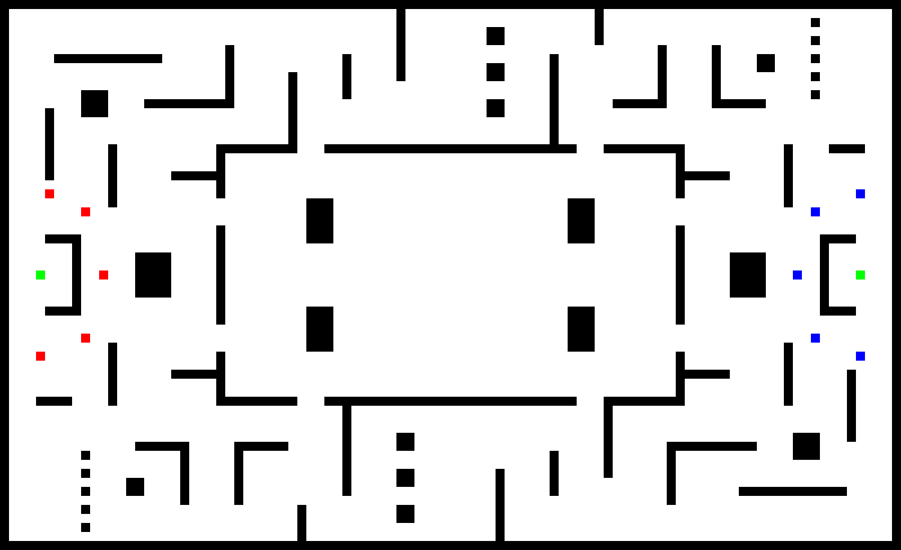

# Robot Arena

An exercise in genetic programming where two teams of robots fight to win a laser tag-style game. Each team is
controlled by a randomly generated snippet of code. Snippets of code that are successful get mutated and spliced with
other code to create variants, and then those variants are pitted against each other. Eventually the robots should
evolve useful pathfinding and combat behaviours.

## Basic concepts

**Arena:** The robots are in a grid-based arena with walls that block line of sight and laser fire.

**Scoring:** Each team has a goal object on their side of the arena. If it's destroyed, they instantly lose. Scoring
is as follows:

* Killed a robot from the opposing team: +1 point
* Killed a robot from your own team: -2 points
* Game ends because an entire team is dead: +3 points to the winning team
* Game ends because it ran over time: -5 points to each team. This ensures that a stalemate game can never result in a positive score for either team.
* Game ends because the enemy's goal is destroyed: +10 points to the winners
* Game ends because you blew up your own goal: -20 points to the losers

The score is the fitness criterion for the gene splicer; scripts which consistently score higher than others will be
promoted to future generations.

**Robots:** Each team has five robots. They can move in orthogonal directions. They can shoot at each other with lasers
that are not 100% accurate; the chance to hit decreases sharply with distance from the target. Robots only have one hit
point, so a single laser hit will knock them out.

At present there's no concept of facing, so a robot can see and fire in any direction. I'm strongly considering adding
a cooldown so that you can only fire every other turn, or maybe every three turns.

**Time:** Each robot can take one action (move, shoot, wait) per tick of the simulation. A game that hasn't completed
after 2,000 ticks ends automatically because the robots are probably just stuck in corners running into walls like
idiots.

## Scripting language

The language which the robot-controlling scripts are written in is a lobotomized little Lisp I call RoboScript. There's
only a single type: integers. For truthiness, zero is false and non-zero numbers are true. You can't define any new
functions, and there are no variable-arity functions. All scripts **must** be deterministic, so that a game with the
same starting conditions will always have the same results.

Directions are represented as integers:
0. North
1. South
2. East
3. West

All directions are relative to the team's starting orientation. As far as the robot is concerned, the enemy's goal is
north and its goal is south. This, plus the symmetrical arena, allows a script to work the same no matter which team
it's controlling. If you pass a number outside of the range 0–3 to a direction-using function, it will do `direction %
4` to turn it into a valid direction.

(Note that the following list of functions is a work in progress. I'll probably need to do a lot of adjustment here,
since the correct choice of language primitives makes a huge difference to the success of the genetic process.)

### Language primitives

`(if condition true-expression false-expression)`: Your basic conditional.
`(and expr expr)`: Returns the value of the last expression if both are true, or `0` if false.
`(or expr expr)`: Returns the value of the first true expression, or `0` if neither are true.
`(not expr)`: Returns `0` if `expr` is true and `1` if it's false.

### Predicates

`(> a b)`: True if `a` is greater than `b`.
`(< a b)`: True if `a` is less than `b`.
`(= a b)`: True if `a` is equal to `b`.
`(can-move? direction)`: True if the space in that direction is empty (no walls, goals, or bots).
`(enemy-visible?)`: True if any enemy robot is within sight.
`(enemy-goal-visible?)`: True if the enemy's goal is within sight.
`(own-goal-visible?)`: True if your own goal is within sight.

### Actions

Calling one of these functions will immediately end the script and execute the action.

`(move direction)`: If the indicated space is empty, moves the bot there; if not, same as `wait`.
`(wait)`: Do nothing for one tick.
`(shoot direction)`: Fire a laser in the given direction.
`(shoot-nearest)`: Fire a laser at the nearest enemy or goal.

### Math

`(+ n n)`
`(- n n)`
`(* n n)`
`(/ n n)`  (note: integer division only.)
`(mod n n)`

To do: integer negation? absolute value?

### Other functions

`(tick)`: How many ticks have passed since the start of the game.
`(number-of-visible-enemies)`: The number of enemies in this robot's field of view.
`(my-x-pos)`: The robot's X coordinate (rotated relative to the team's orientation)
`(my-y-pos)`: The robot's Y coordinate (rotated relative to the team's orientation)

## Input

### Command-line syntax

A "scenario" is a single sequence of generations, starting from complete randomness and hopefully ending in something interesting.

`run <scenario> <number of generations>`: Runs the simulation for N generations.
`view <scenario> <generation> <match>`: Runs the given match and outputs the result to GIF and MP4.

### Arena map

The pixels in the arena map at `arena.png` have the following meanings:

`#000000`: Black, a wall
`#ffffff`: White, open space
`#ff0000`: Red, a spawn point for Team A (counts as open space)
`#ff0100`: Red, a spawn point for Team B (counts as open space)
`#00ff00`: Green, goal for Team A
`#01ff00`: Green, goal for Team B

If you want to edit the map, be sure that it remains symmetrical! Otherwise you'll get inconsistent results.

## Output

We'll also write machine-readable statistics to a couple of files after each match.

### Cell statistics

After a match, we record per-cell statistics in a binary file called ``scenario/<name>/<gen>/cells`. For each cell, it records:
* The number of times a robot moved into the cell
* The number of times a robot shot while standing on the cell
* The number of times a robot was killed on the cell
* The number of times a robot waited on the cell

I plan to create a tool later which will sum the results for all matches in a generation and visualize them as heatmaps
superimposed over the arena, so one can see at a glance how successful a given generation has been.

### Generation results

We track the progress of each generation in a file called `results.csv` in that generation's folder. It tracks the
following data points, one row per match:

`matchId,scriptA,scriptB,scoreA,scoreB,ticks`

* `matchId`: A unique identifier for the match
* `scriptA`: The unique identifier of the script file that Team A was using
* `scriptB`: The unique identifier of the script file that Team B was using
* `scoreA`: The final score for Team A
* `scoreB`: The final score for Team B
* `ticks`: How many ticks elapsed between the start and end of the match

We'll use these results to decide which scripts get spliced and mutated for the next generation.
